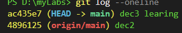

## Git

## lab1


this output tells us that hello.py is now in the staging area, ready to be committed.

Why do we need a staging area? Imagine you're packing for a trip. The staging area is like your suitcase - you can add items (changes) to it, remove items if you change your mind, and when you're happy with everything in the suitcase, you zip it up (make a commit). This allows you to carefully curate what goes into each commit, making your project history more organized and meaningful.

#### Ignoring Files with .gitignore

Ignoring Files with .gitignore

#### git diff

```
diff --git a/hello.py b/hello.py
index ed51d3f..1385fe3 100644
--- a/hello.py
+++ b/hello.py
@@ -1 +1 @@
-print('Hello, Git!')
+print('Hello, Git! Welcome to the staging area.')

```


## lab2

- git add filename
- .gitignore file
- `echo "print('Hello, Git!')" > hello.py`
- `echo "print('Hello, Git! Welcome to the staging area.')" > hello.py`
- git diff

- Sometimes, you might add a file to the staging area and then change your mind. Git allows you to unstage changes easily.

- Now, let's say we've changed our mind and don't want to include these changes in our next commit. We can unstage the file using the git restore command:
 
- `git restore --staged hello.py`

1. How to add files to the staging area using git add
2. How to ignore files you don't want to track using .gitignore
3. How to view changes in your files before committing with git diff
4. How to unstage changes using git restore --staged


## lab3


❓❓❓
`echo -e 'print("Initializing Chrono-Gadget...")\nprint("Warning: Temporal flux detected!")\nprint("Calibrating time circuits...")\nprint("Ready for time travel!")' > chrono_gadget.py
`

Congratulations, master of temporal inspection! You've successfully prepared your chrono-gadget and demonstrated your ability to review its contents in the staging area before embarking on your time-travel adventure. In this challenge, you've shown proficiency in:

1. Initializing a new Git repository for your time travel preparations.
2. Creating a file with essential information for your journey.
3. Using the Git staging area to prepare changes for commit.
4. Employing git diff --staged to review changes in the staging area.  

This skill of reviewing staged changes is crucial for any serious time traveler. By mastering the `git diff --staged` command, you've gained the ability to carefully inspect your temporal payload before each leap through time. This meticulous approach ensures that you're always aware of exactly what changes you're about to commit to the timeline.

Remember, a well-inspected staging area is the key to successful chrono-exploration. As you continue your journey through the Git-time continuum, this reviewing skill will prove invaluable. It will help you maintain a clean and organized timeline, catch potential temporal anomalies before they cause paradoxes, and always know exactly what changes you're about to cement into the fabric of space-time.

Keep exploring, keep staging, and most importantly, keep reviewing! The future (and past) of code awaits your carefully inspected commits. Safe travels, Chrono-Coder!   

#### Tracked and Staged are different things

tracked untracked staged unstaged


## lab4

Summary
Congratulations, master of the multiverse! You've just completed your crash course in Git branch wizardry. Let's recap the incredible feats you've accomplished:

You created a hub for infinite possibilities (a new Git repository).
You opened a portal to an alternate reality (created a new branch).
You learned to jump between different dimensions (switch branches using git checkout or git switch).
You made groundbreaking discoveries in a parallel universe (committed changes in a separate branch).
You merged two realities, bringing your discoveries into the main timeline (merged branches).
Finally, you learned how to close dimensional portals you no longer need (delete branches).
These multiversal skills are crucial for any time-traveling developer. By using branches, you can:

Work on different features or bug fixes in parallel universes, without disrupting the main timeline.
Experiment with wild ideas in safe, alternate realities.
Collaborate with other dimension-hopping developers, each working in their own reality.
Keep your main timeline stable and glitch-free, only merging in new features when they're ready.
Happy dimension hopping, and may your merges always be conflict-free!

## lab5
Secure the Artifact and Document Your Findings
Tasks
Create a new branch called artifact-study from the master branch.
In the artifact-study branch, create a file named temporal-artifact.txt with a brief description of the artifact.
Update the README.md file to include a section about your ongoing artifact study.
Commit your changes in the artifact-study branch.
Merge the artifact-study branch back into master.
Requirements
All operations must be performed in the /home/labex/project/time-travel-hub repository.
The temporal-artifact.txt file must contain at least one line describing the artifact, you can use the following text: "A glowing orb that seems to distort time around it. Further study is needed to understand its full capabilities and potential risks."
The README.md file must have a new section titled "## Temporal Artifact Study" with at least one line of information.
Use meaningful commit messages for all your commits.
Ensure you're on the master branch after completing all operations.
The artifact-study branch should still exist after merging.

#### Summary
In this challenge, you've put your Git branch wizardry to the test in a high-stakes time travel scenario. You created a separate reality (branch) to study a powerful temporal artifact, documented your findings, and successfully merged this critical information back into the main timeline. By using Git branches, you were able to experiment safely without risking the integrity of the main timeline.

This exercise demonstrated the practical application of creating branches, making and committing changes, and merging branches. These skills are crucial for managing complex projects and collaborating with other developers, allowing you to work on features or experiments in isolation before integrating them into the main project.

By keeping the artifact-study branch after merging, you've maintained a record of this separate line of investigation. This can be useful for future reference or if you need to continue your study of the temporal artifact.

Remember, with great power comes great responsibility. Use your Git branch skills wisely as you continue your adventures through time and code!


## lab6
this command appends a new line to our "hello.txt" file. Let's understand the >> operator:  

`>` would overwrite the entire file with the new content.  
`>>` appends the new content to the end of the existing file, preserving the original content.  
So, after running this command, "hello.txt" will contain two lines:

>Bilkul sahi, bhai. git commit --amend sirf aur sirf LAST commit par apply hota hai.

#### Reverting a Commit
Sometimes, you make a commit and later realize it introduced a bug or you simply want to undo those changes. You might think of using git reset to go back in time and remove the commit. However, git reset can be destructive, especially if you've already pushed your changes or if others are working on the same branch. A safer and more collaborative way to undo changes is using git revert.

git revert creates a new commit that undoes the changes introduced by a specific commit. It doesn't erase the original commit from history; instead, it adds a new commit that effectively reverses the effects of the unwanted commit. This preserves the history and is much safer for shared repositories.




lets use amend cmd

`git commit --amend -m "dec3 LEARNINGS"`


---

###  revert vs reset

***reset***  
> - hard
> - soft
> - mixed(default) 


***revert***  
***rebase***  
***Cherypick***  


🟦 CATEGORY–1 → CONTENT HISTORY CHANGE


| Purpose                                  | Command                           | What it affects    | Dexter Analogy                    |
| ---------------------------------------- | --------------------------------- | ------------------ | --------------------------------- |
| Working file ko previous version pe lana | `git restore <file>`              | ❗ONLY file content | Episode same, scene rollback      |
| Staged file ko unstage karna             | `git restore --staged <file>`     | Staging area       | Scene editing room se scene hatao |
| Kisi purane commit se file nikalna       | `git checkout <commit> -- <file>` | Working file       | Purane episode ka scene import    |
| Local file edit karna                    | manual edits                      | File content only  | Scene me dialogue/shot change     |


🟥 CATEGORY–2 → COMMIT HISTORY CHANGE

| Purpose                           | Command                    | What it affects          | Dexter Analogy                     |
| --------------------------------- | -------------------------- | ------------------------ | ---------------------------------- |
| Commits delete/rewind karna       | `git reset --soft`         | Timeline + staging       | Episodes removed, footage intact   |
|                                   | `git reset --mixed`        | Timeline + local changes | Episodes removed, scenes floor pe  |
|                                   | `git reset --hard`         | Timeline + files         | Episodes destroyed & scenes burned |
| Past commit ka fix episode banana | `git revert <commit>`      | Adds new commit          | Aired episode ka correction add    |
| Last commit modify karna          | `git commit --amend`       | Rewrite last commit      | Last episode ko dubara edit        |
| Ek specific commit copy karna     | `git cherry-pick <commit>` | New commit added         | Alternate universe ka scene copy   |
| Commits reorder, edit, delete     | `git rebase -i`            | Full history rewrite     | Whole season reorder / reshoot     |
| Branch ko new base pe replay      | `git rebase branch`        | Rewrite commits          | Scenes ko latest script pe reshoot |


## lab7 Git-stash 

 1. 
    
    ```cd ~/project
    mkdir git-stash-lab
    cd git-stash-lab
    git init
    echo "# Git Stash Lab" > README.md
    git add README.md
    git commit -m "Initial commit"
    ```
2. untrack file
```
echo "Some important notes" > notes.txt
```
do not add this 

3. Creating a Branch from a Stash

```
Sometimes, you might realize that the changes you stashed should actually be on their own branch. Git makes this easy with the git stash branch command.
```

This feature is particularly useful when you've stashed some experimental changes and later decide they're worth pursuing on their own branch.  

Remember, after creating a branch from a stash, you'll need to commit the changes if you want to keep them:

**multiple stash**    
As you work with Git, you might find yourself stashing multiple sets of changes. Git allows you to manage multiple stashes easily. Let's explore how to create, list, and manage multiple stashes.

```
# First stash
echo "Change 1" >> README.md
git stash push -m "First change"

# Second stash with untracked file
echo "Change 2" >> README.md
echo "Note 2" >> notes.txt
git stash push -u -m "Second change"

# Third stash
echo "Change 3" >> README.md
git stash push -m "Third change"
```

`git stash push -m "First change"`

Iska matlab:

push → changes ko stash stack me push karo  

-m "first change" → stash ko message/label do  

***but zyada clear + controllable hai***
```
stash@{0}: On main: first change
stash@{1}: On main: login fix
```

Note: You'll notice we're now using git stash push instead of just git stash. The push subcommand is the modern, preferred way to create stashes, especially when you want to add custom messages with the -m flag. While git stash and git stash -u still work (they're shortcuts for git stash push and git stash push -u), using git stash push explicitly gives you more control and clarity, particularly when managing multiple stashes with descriptive messages.  

Let's break down what we did:  

Created first stash with a change to README.md  
Created second stash with both a change to README.md and a new untracked file  
Created third stash with another change to README.md  
Used the -m flag to add descriptive messages  
Used the -u flag for the second stash to include the untracked file  
Now, let's list our stashes:  

```
stash@{0}: On master: Third change
stash@{1}: On master: Second change
stash@{2}: On master: First change
```

```
git stash show stash@{1}
```

```
stash@{0}: On master: Fifth change
stash@{1}: On master: Fourth change
stash@{2}: On master: Third change
stash@{3}: On master: Second change
stash@{4}: On master: First change
```

***Cleaning Up Stashes***
```
git stash drop stash@{2}
```
If you want to remove all your stashes at once, you can use:
`git stash clear`

Another useful command is git stash pop, which we saw earlier. It applies the most recent stash and then removes it from the stash list:
`git stash pop`

**Summary**  
Congratulations, Git stash master! You've just added a powerful new tool to your Git toolkit. Let's recap the key concepts we've covered:

Stashing Changes: You learned how to temporarily store your work-in-progress using git stash.
Applying Stashed Changes: You discovered how to bring back your stashed changes using git stash apply and git stash pop.
Creating Branches from Stashes: You saw how to turn a stashed set of changes into a new branch with git stash branch.
Managing Multiple Stashes: You learned how to work with multiple stashes, applying and showing specific stashes as needed.
Cleaning Up Stashes: You practiced good stash hygiene by learning how to remove individual stashes and clear all stashes.
Git stash is an incredibly useful feature that allows you to quickly switch contexts without committing half-done work. It's perfect for those moments when you need to quickly switch tasks or branches.

Remember, while stashes are useful, they're meant to be temporary. For longer-term work, it's usually better to commit your changes or create a new branch. Use stashes wisely, and they'll help you keep your workflow smooth and flexible.

## lab8 -stash pratical 
To complete this challenge, follow these steps:

1. Navigate to the correct directory:
    ```
    cd ~/project/time-machine
    ```

2.  Stash changes including untracked files:
    ```
    git stash -u
    ```

3.  Fix the "critical bug" on the master branch:
    ```
    echo "Fixed: Temporal Flux Stabilized" > main-console.txt
    git commit -am "Fix critical temporal flux bug"
    ```
4.  Create a new branch from the stash and apply changes:
    ```
    git stash branch future-upgrades
    ```
5.  Merge the changes from the master branch into the new branch:
    ```
    git merge master
    ```
6.  Verify the changes:
    ```
    # Check the master branch
    git checkout master
    cat main-console.txt

    # Check the future-upgrades branch
    git checkout future-upgrades
    cat main-console.txt
    cat flux-capacitor.txt
    cat new-feature.txt
    ```

7. This solution accomplishes all the required tasks:

- It stashes all changes, including untracked files, using git stash -u.
- It fixes the bug in main-console.txt on the master branch.
- It creates a new branch named future-upgrades from the stashed changes using git stash branch.
- The original changes (both tracked and untracked) are present in the new branch because git stash branch applies the stashed changes to the new branch.

After following these steps, the repository will be in the state described in the example, with the bug fixed on both branches and the work-in-progress changes present on the future-upgrades branch.

In this challenge, you've practiced using Git stash in a simulated emergency scenario. You've learned how to quickly save your work-in-progress (including untracked files), switch contexts to fix a critical issue, and then create a new branch from your stashed changes. These skills are crucial for maintaining a smooth workflow when unexpected tasks arise, allowing you to juggle multiple responsibilities without losing your work or breaking your concentration.

Remember, while Git stash is a powerful tool for temporarily storing changes, it's best used for short-term storage. For longer-term work or significant features, creating dedicated branches is often a better approach. Keep practicing these skills, and you'll be well-equipped to handle any time-bending development scenarios that come your way!


## lab9-tags

## lab10 - commit history 

**Git's most powerful features is its ability to track and display the history of your project**  

```
cd ~/project
mkdir git-history-lab
cd git-history-lab
git init
```
```
echo "# Git History Lab" > README.md
git add README.md
git commit -m "Initial commit"

echo "function hello() {" > script.js
echo "  console.log('Hello, Git!');" >> script.js
echo "}" >> script.js
git add script.js
git commit -m "Add hello function"

echo "function goodbye() {" >> script.js
echo "  console.log('Goodbye, Git!');" >> script.js
echo "}" >> script.js
git add script.js
git commit -m "Add goodbye function"

echo "This is a test file" > test.txt
git add test.txt
git commit -m "Add test file"

echo "hello();" >> script.js
echo "goodbye();" >> script.js
git add script.js
git commit -m "Call hello and goodbye functions"
```

We created a README file and made our initial commit.  
We created a JavaScript file with a "hello" function and committed it.  
We added a "goodbye" function to the same file and committed it.  
We added a test file and committed it.  
Finally, we modified our script to call both functions and committed the changes.  


## lab11 - git diff


## lab12 - recover deleted files

1. Navigate to the project directory:


```
cd ~/project/important-project

git reflog

1234567 HEAD@{0}: commit: Update project status
abcdefg HEAD@{1}: commit: Oops, accidentally deleted important files
9876543 HEAD@{2}: commit: Update algorithm TODO
fedcba0 HEAD@{3}: commit: Add crucial data and algorithm
...

git checkout 9876543

Tips: If you use git reset --hard 9876543, it will also work, but it will change the commit history. Using git checkout keeps the commit history intact.

ls

You should see important_algorithm.py and crucial_data.txt in the output.

Copy the recovered files to the temporary folder:
cp important_algorithm.py crucial_data.txt ~/project


git checkout master

mv ~/project/important_algorithm.py ~/project/crucial_data.txt .

git add important_algorithm.py crucial_data.txt

git commit -m "Recover deleted files"

ls
git status
git log -1


```


2. Use git reflog to examine the repository's history:

3. Identify the commit hash where the important files were last present. In this case, it's the commit with the hash 9876543 (message: "Update algorithm TODO").
4. Use git checkout to restore the repository to the state just before the deletion:
5. 
6. 
7. 
8. 
9. 
10. 


## lab13 -clone

**Shallow Clone with Depth**

## lab14 - unstage a file

`git rm --cashed fileName`


## lab15 - ready a Git server from scratch 

In this project, you will learn:

- How to install and configure Git on a Linux system  
- How to create and manage a user specifically for Git operations
- How to generate and configure SSH keys to secure connections between your local machine and the Git server
- How to initialize and manage a Git repository locally and on a server
- How to perform version control operations such as committing changes and pushing them to a remote repository
- How to verify the setup by cloning the repository to ensure everything is functioning correctly

🏆 Achievements  
After completing this project, you will be able to:  

- Understand the fundamentals of installing and setting up Git, a distributed version control system, on a Linux environment
- Handle user permissions and security in a Unix/Linux system for application-specific tasks
- Utilize techniques for secure communication between machines using SSH keys, an essential skill for managing remote servers
- Create and manage bare Git repositories which are used for server-side storage in Git operations
- Commit and version your projects using Git commands, and push these changes to a remote server
- Verify and troubleshoot common issues in remote repository management by cloning and inspecting the integrity of the data

1. 
 Update the apt package database to ensure we are working with the latest software list
`sudo apt-get update`

Install Git using apt-get
`sudo apt-get install git`


2. 
```
# Create a new user for Git operations
sudo useradd labex-git
sudo passwd labex-git


sudo mkdir /home/labex-git
sudo chown -R labex-git:labex-git /home/labex-git
```

3. Generating SSH Keys

```
# Generate an SSH key pair
ssh-keygen -t rsa -C "labex@labex.io"
```
cat ~/.ssh/id_rsa.pub | ssh labex-git@localhost 'mkdir -p ~/.ssh && cat >> ~/.ssh/authorized_keys'