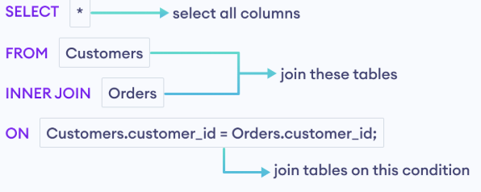
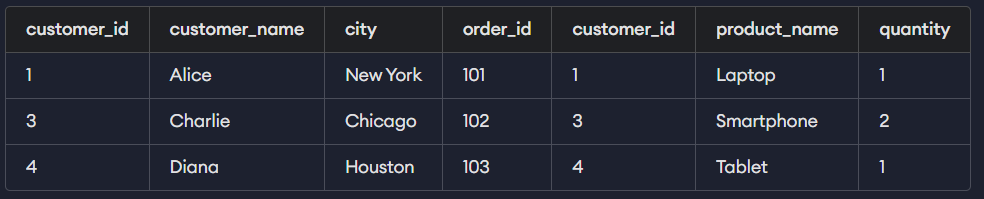
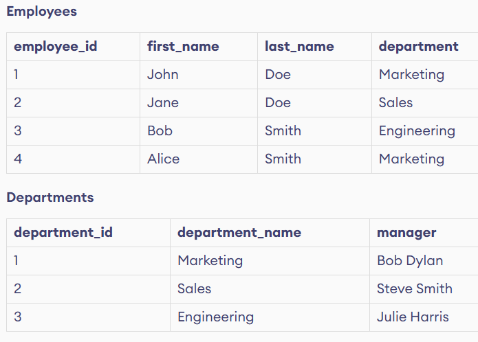
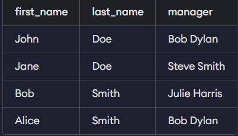

## SQL - structured query language

Unlike known values, you cannot use comparison operators when working with NULL. Instead, use IS NULL or IS NOT NULL.

```sql
SELECT *
FROM Employees
WHERE last_name IS NULL
AND first_name LIKE '%e';
```

###  **Aggregate Functions**

>To derive insights from the data, you need to analyze and summarize this information.  

There are five commonly used aggregate functions:

1. MIN()
2. MAX()
3. COUNT()
4. SUM()
5. AVG()


DISTINCT keyword selects unique rows.

```sql
SELECT COUNT(DISTINCT department)
FROM Employees;
```
>A common mistake is writing SELECT DISTINCT COUNT(department) instead of COUNT(DISTINCT department). Always ensure the DISTINCT keyword is used inside the COUNT() function. 

```sql

--Write an SQL query to select the count of distinct products from the ByteCore or ZapTech brands.

-- Also, the column name in the output should be distinct_product.

SELECT COUNT(DISTINCT name)as distinct_product FROM Products WHERE brand IN('ByteCore','ZapTech');

```

### *SQL SUM() Function*

The SUM() function calculates the total sum of a numeric column.
```sql
-- Return the total of all employees' salaries

SELECT SUM(salary) 
FROM Employees;
```

<!-- SELECT SUM(age)/COUNT(age) from Employees; -->

```sql
--Write an SQL query to calculate the total quantity of products whose price is more than 160.
--Also, the column name in the output should be total_products.

SELECT SUM(quantity) as total_products FROM Products WHERE price > 160;
```


## organize data effectively using SQL
` ORDER BY `

```sql
SELECT * FROM Customers ORDER BY name DESC;
```

# conflict ❓❓
```sql 
SELECT name, purchase_amount 
FROM customers
ORDER BY purchase_amount DESC, name ASC;
```


## ***Group by***

What if you're asked to find the average purchase amount by country? Simply using the AVG() function isn't enough.

This is where the GROUP BY clause comes in handy in SQL. It helps you answer questions like:

- What is the average purchase amount of customers in each country?
- What are the highest and lowest purchase amounts in each country?


```sql
-- Group data by different country

SELECT country, purchase_amount
FROM Customers
GROUP BY country;

country	| purchase_amount
Canada	| 6000
UK	    | 2000
USA	    | 1000
```

>The output shows the country and purchase amount of the first customer in each country, but this isn't a meaningful summary.

>Therefore, the GROUP BY clause is almost always used in conjunction with aggregate functions such as SUM(), MIN(), COUNT(), etc., to summarize data.


### However, when using GROUP BY with aggregate functions, the WHERE clause doesn't work, resulting in an error.


```sql
Write an SQL query to find the total sales for each product that exceeds 1700. The query should return the product name and total sales for each product.

Hint: The total sales of a product is calculated by multiplying the price and quantity for each sale.


SELECT product ,SUM(quantity * price) as total_sales
FROM Sales
GROUP BY product
HAVING SUM(quantity * price)>1700;
```


## SQL CASE


it is similar to if-else / switch case of progrmaming language.

```sql
-- Write your SQL code below
SELECT *,
    CASE
        WHEN country IN('USA','Canada') THEN 'North America'
        WHEN country IN('Sweden','Czech Republic') THEN 'Europe'
        ELSE 'Other'

    END as continent
FROM Customers;
```

```sql
SELECT first_name,country,
    CASE
        WHEN country IN('USA','Canada') THEN 'North America'
        WHEN country IN('Sweden','Czech Republic') THEN 'Europe'
        ELSE 'Other'

    END as continent
FROM Customers
WHERE age < 26;
```

**TEST**  
Questions to Answer  
In this recap, you'll explore the following questions about the company's employees:  

1. High-Earning Employees
Which employees have the highest salaries, listed in descending order?
2. Salary Insights
What is the salary range (highest and lowest) in each department?
3. Workforce Distribution
How many employees are there in each department?
Which departments have fewer than two employees?
4. Targeted Training and Events
Which employees' names contain the letter "J"?
Which employees are eligible for promotion based on their years of service?


🔹 COUNT(*)

- Har row count karta hai
- NULL ho ya na ho → row count hogi
- Safest & standard

🔹 COUNT(column_name)

- Sirf non-NULL values count karta hai
- Agar column mein NULL hua → wo row ignore ho jayegi


Visuallyy
```
Employees
------------------------------------------------
id | name     | department
------------------------------------------------
1  | Peter    | Operations
2  | Meghan   | Sales
3  | Jow      | Tech
4  | Mike     | Sales
5  | Mary     | Operations
7  | Elon     | Tech
8  | Samantha | Marketing
9  | John     | Sales
```

2️⃣ GROUP BY department kya karta hai?  
```
OPERATIONS bucket
-----------------
Peter
Mary


SALES bucket
------------
Meghan
Mike
John


TECH bucket
-----------
Jow
Elon


MARKETING bucket
----------------
Samantha

```

whereas 
```
SELECT department, COUNT(*)
FROM Employees
GROUP BY department;
```

```

department   | count
--------------------
Operations   | 2
Sales        | 3
Tech         | 2
Marketing    | 1

```

```
COUNT(*)        → counts rows
COUNT(column)   → counts NON-NULL values only
```

```sql
Meghan
Mike
John
NULL

--COUNT(*)
Sales → 4

--COUNT(name)
Sales → 3   ❌ (NULL ignore ho gaya)

--Rule
COUNT(*)        → counts rows
COUNT(column)   → counts NON-NULL values onlye


--GROUP BY pehle rows ko groups mein baantta hai phir aggregation un groups par kaam karti hai


FROM
 ↓
WHERE
 ↓
GROUP BY
 ↓
AGGREGATION (COUNT, SUM, AVG...)
 ↓
SELECT
 ↓
ORDER BY

➡️ Isliye SELECT * + GROUP BY ❌ invalid hota hai

```

```
GROUP BY = bucket banana
COUNT/SUM = bucket ka hisaab

```

## JOINS

**SQL INNER JOIN**

An INNER JOIN combines records from two tables where the specified condition is met, excluding unmatched rows from both tables





As a data analyst, you won't often be asked to perform INNER JOINs directly. Instead, you may need to answer questions like:

- How can you list customers along with their cities and purchased products?
- How can you find products bought by customers in New York?

---
<div align="center"> 
    
</div>


<!--  -->
```sql
SELECT e.first_name,e.last_name,d.manager
FROM Employees e
INNER  JOIN Departments d 
ON  e.department = d.department_name
```
<div align="center"> 
    
</div>


### SQL RIGHT JOIN
A RIGHT JOIN is similar to a LEFT JOIN, except it selects all the rows from the right table and any matching rows from the left table.


## SUB Query 

The subquery (SELECT AVG(GPA) FROM Students) calculates the average score once. This average is then added as a new column, average_gpa, to each student's record.

Subqueries are often used over joins when working with aggregate functions that require a subset of data to be computed first. Conversely, joins are preferred when performance is a concern with large datasets.

```sql
SELECT name
FROM Students
WHERE course_id IN 
(
    SELECT id 
    FROM Courses 
    WHERE course_name = 'Mathematics'
);

```


## Insert data🔽

Understanding SQL well means you can do more than just run queries; you also need to know how to set up and change the database as needed.

- **Inserting** data into tables
- **Updating** data in tables
- **Deleting** data from tables

```sql
INSERT INTO Students (id, name, course_id, GPA)
VALUES (6, 'Emma Stone', 'C101', 3.8);


-- Insert three rows

INSERT INTO 
    Students (id, name, course_id, GPA)
VALUES
    (15, 'Amelia Charles', 'C104', 3.2),
    (12, 'Jaxon Gomez', 'C101', 2.9),
    (13, 'Mike Leon', 'C103', 3.4);    
```
---


### *Update existing row*

```sql
UPDATE Students
SET GPA = 3.95
WHERE id = 3;
```

1.  What if values are mismatched?
    - ❌ ERROR (most of the time)
2. What if insufficient values are given?
    - ❌ ERROR
3. When can SQL allow fewer values? ✅
    - Case A: Column has DEFAULT
    - Case B: Column allows NULL
    - Case C: Column is NOT NULL ❌
4. What if values are extra?
    - error


### ❓QUESTIONS

```sql
CREATE TABLE Users (
  id INT PRIMARY KEY,
  name VARCHAR(50) NOT NULL,
  email VARCHAR(100),
  status VARCHAR(20) DEFAULT 'ACTIVE'
);

---

INSERT INTO Users (id, name)
VALUES (1, 'Rahul');

```

1️⃣ Will this query WORK or FAIL?  
2️⃣ Final values kya hongi in table for:

my ans- fail,because email is missing and null is not set

**BUT**
🔻By default, every column is NULLABLE


# SQL INSERT — NULL vs DEFAULT vs NOT NULL (Quick Reference)

## 1. NULL
- NULL ka matlab: **value unknown / missing**
- NULL ≠ 0 ≠ empty string
- Agar column NULLABLE hai:
  - value na do → SQL **auto NULL** set karta hai
  - `NULL` explicitly likhna optional hai

### Example
```sql
email VARCHAR(100)

INSERT INTO Users (id, name)
VALUES (1, 'Amit');
-- email = NULL
```

2. NOT NULL

- NOT NULL column mandatory hota hai

- Na value chhod sakte ho

- Na NULL assign kar sakte ho

```sql
name VARCHAR(50) NOT NULL

INSERT INTO Users (id)
VALUES (1);
-- ❌ ERROR

```


3. DEFAULT

DEFAULT = system-provided fallback value

Agar value omit ki → DEFAULT auto apply hota hai

```sql
status VARCHAR(20) DEFAULT 'ACTIVE'
INSERT INTO Users (id, name)
VALUES (1, 'Rahul');
-- status = 'ACTIVE'

```
```
Missing value →
  NOT NULL & no DEFAULT → ERROR
  DEFAULT present → DEFAULT used
  NULL allowed → NULL auto
```

## 📋Working with Tables

As the startup grows, relying on spreadsheets for storing customer details becomes impractical. In this chapter, you'll cover:

Creating tables: Setting up a table to store customer details like names and addresses.
Altering tables: Making changes to the table, such as adding new columns to track additional information.
Dropping tables: Removing tables that are no longer necessary.
Before creating tables, it's important to understand SQL data types. Data types determine what kind of values a column can hold.

To learn more about data types, please refer to this article.


```sql
CREATE TABLE Customers (
        id int,
        first_name VARCHAR(50),
        last_name VARCHAR(50),
        age int,
        country VARCHAR(50)
);


INSERT INTO 
    Customers (id,first_name,last_name,age,country)
VALUES
    (1,'Ethan','Carter',30,'Australia'),
    (2,'Sofia','Patel',27,'India');


SELECT * FROM Customers;
```

### CREATE TABLE IF NOT EXISTS

```
CREATE TABLE IF NOT EXISTS Customers (
    id int,
    first_name VARCHAR(50),
    last_name VARCHAR(50),
    age int,
    country VARCHAR(50)
);
```

Now, even if the Customers table already exists, the query will not run unnecessarily, preventing errors.


## Modify Table

### ADD COLUMN
```sql
-- Add a column

ALTER TABLE Customers
ADD COLUMN city VARCHAR(200);
```

### edit table

While working with the Customers table, you notice that some customer names are getting cut off because the first_name column is limited to 50 characters.

To fix this, you can expand its character limit to store longer names:

```sql

-- Modify a column

ALTER TABLE Customers
MODIFY COLUMN first_name VARCHAR(100);
```

Now, the first_name column can store longer names, preventing data loss.

>Note: The database system we are using is SQLite, which does not support modifying columns. However, other popular database systems do support them.


### Rename column name

```
-- Rename a column

ALTER TABLE Customers
RENAME COLUMN id TO customer_id;
```


start gain


>Note: Like the INSERT INTO statement, the UPDATE statement does not display any output; it simply modifies the existing table. You can use a SELECT query or check the Available Tables section to verify your updates.


## ALTER TABLE

- Add a new column (e.g., to store customer city)
- Modify a column (e.g., to increase the name length)
- Rename a column (e.g., to rename id to customer_id)
- Delete a column (e.g., to remove the last_name)
- Rename a table (e.g., to rename Customers table to Users)


# CONSTRAINTS

NULL
NOT NULL 
PRIMARY
FORIEGN

## PRIMARY KEY 
A primary key is a column or a set of columns uniquely identifying each row in a table. This constraint enforces both the NOT NULL and UNIQUE constraints.

```sql
CREATE TABLE Concerts (
    performer_name VARCHAR(255) NOT NULL,
    concert_datetime DATETIME UNIQUE,
    concert_id INTEGER PRIMARY KEY AUTOINCREMENT,
    genre_id INTEGER,
    FOREIGN KEY (genre_id) REFERENCES Genres(id)
);

CREATE TABLE Genres (
    id INTEGER PRIMARY KEY AUTOINCREMENT,
    genre_name VARCHAR(255) NOT NULL
);
```

## WINDOW FUNCTIONS

**Que**-"Can you help us understand how the salaries are spread out in the company? We want to know if some people are earning more or less than others on average."

Your job is to calculate the average salary of everyone in the company and then compare each person's salary to this average.


❓❓
```
SELECT *,
    ROW_NUMBER() OVER (PARTITION BY country ORDER BY age DESC) AS row_number,
    RANK() OVER (PARTITION BY country ORDER BY age DESC) AS rank,
    DENSE_RANK() OVER (PARTITION BY country ORDER BY age DESC) AS dense_rank
FROM Customers;

```