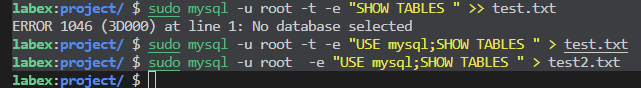
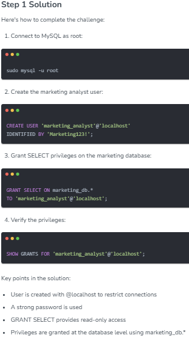

## ✨Lab1

- MariaDB is a fork of MySQL, created by the original developers of MySQL. It's designed to be a drop-in replacement for MySQL, meaning it's fully compatible with MySQL syntax and operations.
- MariaDB was created to ensure that a truly open-source version of MySQL would always be available. It maintains high compatibility with MySQL while also offering some unique features and improvements.
- For the purposes of this lab and most basic to intermediate MySQL operations, you can treat MariaDB exactly as you would MySQL. All the commands we'll use in this lab work identically in both MariaDB and MySQL.
- MariaDB is often considered more lightweight and faster than MySQL, which makes it an excellent choice for learning environments like this lab. You might notice quicker response times, which can make your learning experience smoother.
- Many Linux distributions, including some versions of Ubuntu, now use MariaDB as their default MySQL-compatible database system due to its open-source nature and performance benefits.

🔻 Tasks
1. Start the MySQL service
2. Connect to MySQL as the root user
3. List all databases in the system
4. Select and explore the mysql system database̥
5. List all tables in the mysql database
6. Save the list of tables to a file named system_tables.txt in the ~/project directory, which has been created for you.

🟢
```shell
sudo apt update
sudo
```



tee comman❓❓❓❓

>use of sleep command

1. Using   `INTO OUTFILE`
    - permission issue
    - no overwrite

2. Redirect output to a file using `-e`
    - best 
    - less likely to cause issue
 
> Explore \G , \t , \ , -e , -p  

3. tee command


### BEST & SAFE OPTION (Industry preferred)
```sql
mysql -u root -p mydb \
-e "SELECT * FROM students;" \
> /home/labex/project/outG.txt
```
table format

```sql
mysql -u root -p mydb -t \
-e "SELECT * FROM students;" \
> outG.txt

```

## ✨Lab2

By completing this lab, you will be able to:

- Create and drop databases using various methods
- Select and switch between databases
- Retrieve important metadata about your MySQL server and databases
- Understand the case-sensitivity of database names in MySQL


>🧠  
There is no difference in database creation whether executed from (none) state or another database.  
CREATE DATABASE works at server level, not database level.

```
CREATE DATABASE urdBName;
```

### Case-Sensitivity of Database Names
An important concept to understand in MySQL is that database names are case-sensitive. This means that 'Hello_World' and 'hello_world' are treated as two different databases. Let's demonstrate this:

```
```

>Always use lowercase DB names

Note: Be extremely cautious when using the DROP DATABASE command. It permanently deletes the database and all its contents without asking for confirmation. In a production environment, you would typically have safeguards and backups in place before performing such operations.

Dropping a Database Using mysqladmin

```sql
mysqladmin -u root -p drop hello_world2
---
Enter password:
Dropping the database is potentially a very bad thing to do.
Any data stored in the database will be destroyed.

Do you really want to drop the 'hello_world2' database [y/N] y
Database "hello_world2" dropped
```

next

```
USE mysql;
SHOW TABLES;
```

Version

`SELECT VERSION();`
```

MariaDB [mysql]> SELECT VERSION();
+----------------------------------+
| VERSION()                        |
+----------------------------------+
| 10.6.12-MariaDB-0ubuntu0.22.04.1 |
+----------------------------------+
1 row in set (0.000 sec)
```


Present DB
```
MariaDB [mysql]> SELECT DATABASE();
+------------+
| DATABASE() |
+------------+
| mysql      |
+------------+
1 row in set (0.000 sec)
```

Present User

```sql
SELECT USER();

MariaDB [mysql]> SELECT USER();
+----------------+
| USER()         |
+----------------+
| root@localhost |
+----------------+
1 row in set (0.000 sec)
```

`SHOW STATUS LIKE 'Questions';`

```
MariaDB [mysql]> SHOW STATUS LIKE 'Questions';
+---------------+-------+
| Variable_name | Value |
+---------------+-------+
| Questions     | 15    |
+---------------+-------+
1 row in set (0.001 sec)
```

Summary  
In this lab, we've covered fundamental aspects of database management in MySQL:

Creating databases using both the MySQL client and the mysqladmin tool
Listing existing databases and understanding their purposes
Understanding the case-sensitivity of database names in MySQL
Dropping databases safely and the importance of caution when doing so
Selecting and switching between databases
Retrieving important metadata about the MySQL server and databases


## ✨Lab3

Mysql DataTypes

Objectives
By completing this lab, you will be able to:

- Understand MySQL's core data types and when to use them
- Create tables with appropriate column definitions
- Modify existing table structures
- Remove tables when they're no longer needed
- View and understand table metadata


```
CREATE TABLE products (
    id INT AUTO_INCREMENT PRIMARY KEY,
    name VARCHAR(100) NOT NULL,
    price DECIMAL(10,2) NOT NULL,
    description TEXT,
    weight FLOAT,
    in_stock BOOLEAN,
    created_at DATETIME DEFAULT CURRENT_TIMESTAMP,
    last_updated TIMESTAMP DEFAULT CURRENT_TIMESTAMP ON UPDATE CURRENT_TIMESTAMP
);
```
`SHOW TABLES;`
```sql
+--------------+---------------+------+-----+---------------------+-------------------------------+
| Field        | Type          | Null | Key | Default             | Extra                         |
+--------------+---------------+------+-----+---------------------+-------------------------------+
| id           | int(11)       | NO   | PRI | NULL                | auto_increment                |
| name         | varchar(100)  | NO   |     | NULL                |                               |
| price        | decimal(10,2) | NO   |     | NULL                |                               |
| description  | text          | YES  |     | NULL                |                               |
| weight       | float         | YES  |     | NULL                |                               |
| in_stock     | tinyint(1)    | YES  |     | NULL                |                               |
| created_at   | datetime      | YES  |     | current_timestamp() |                               |
| last_updated | timestamp     | NO   |     | current_timestamp() | on update current_timestamp() |
+--------------+---------------+------+-----+---------------------+-------------------------------+
8 rows in set (0.001 sec)
```


`SHOW CREATE TABLE inventory_items;`

```sql
MariaDB [store]> SHOW CREATE TABLE inventory_items;

<!-- Sample output -->

CREATE TABLE `inventory_items` (
  `item_id` int(11) NOT NULL AUTO_INCREMENT,
  `category_id` int(11) DEFAULT NULL,
  `sku` varchar(20) NOT NULL,
  `item_name` varchar(100) NOT NULL,
  `quantity` int(11) NOT NULL CHECK (`quantity` >= 0),
  `unit_price` decimal(10,2) NOT NULL,
  PRIMARY KEY (`item_id`),
  UNIQUE KEY `sku` (`sku`),
  KEY `category_id` (`category_id`),
  CONSTRAINT `inventory_items_ibfk_1` FOREIGN KEY (`category_id`) REFERENCES `categories` (`category_id`)
) ENGINE=InnoDB DEFAULT CHARSET=utf8mb3 COLLATE=utf8mb3_general_ci
```


### DESCRIBE vs SHOW CREATE TABLE (MySQL / MariaDB)

DESCRIBE inventory_items;
- Quick summary of table structure
- Shows: column name, data type, NULL/NOT NULL, key (PK/UK), default, extra
- Does NOT show: full SQL, indexes detail, engine, charset
- Used for: daily dev work, quick checks

SHOW CREATE TABLE inventory_items;
- Shows exact CREATE TABLE SQL
- Includes: columns, constraints (PK/FK/UNIQUE), indexes, engine, charset, collation
- Used for: migrations, debugging production issues, recreating tables, interviews

Key Difference:
- DESCRIBE = structural overview
- SHOW CREATE TABLE = complete schema definition

Analogy:
- DESCRIBE → X-ray report
- SHOW CREATE TABLE → DNA + birth certificate

Interview Tip:
Use DESCRIBE for quick info, SHOW CREATE TABLE for full schema & constraints.


### Modifying Table Structure

1. Add a new column:
```
ALTER TABLE products
ADD COLUMN manufacturer VARCHAR(100) AFTER name;
```

2. Modify an existing column:
```
ALTER TABLE products
MODIFY COLUMN description VARCHAR(500) NOT NULL DEFAULT 'No description available';
```

3. Rename column
```
ALTER TABLE products
CHANGE COLUMN weight product_weight DECIMAL(8,2);
```
This command renames the weight column to product_weight and changes its data type to a decimal number with 8 total digits and 2 decimal places.

4. Drop a column
```
ALTER TABLE products
DROP COLUMN in_stock;
```

## Dropping Tables and Cleanup

In this final step, we'll learn how to safely remove tables when they're no longer needed. This is an important skill, but it should be used with caution as dropping a table permanently deletes all its data.

Before dropping a table, it's good practice to:

1. Verify you're in the correct database
2. Check if the table exists
3. Ensure you have a backup if needed

```
SELECT DATABASE();
SHOW TABLES;

DROP TABLE IF EXISTS inventory_items;


```

safely drop a table, we can use the IF EXISTS clause:

```sql
 DROP TABLE IF EXISTS inventory_items; 
```

>Note that we need to drop tables with foreign key constraints first. If we tried to drop the categories table first, we would get an error because inventory_items references it.

Now we can drop the remaining tables:
```sql
DROP TABLE IF EXISTS categories;
DROP TABLE IF EXISTS products;
```

## ✨LAB4

```sql


MariaDB [(none)]> CREATE DATABASE bookstore if exits bookstore;
ERROR 1064 (42000): You have an error in your SQL syntax; check the manual that corresponds to your MariaDB server version for the right syntax to use near 'if exits bookstore' at line 1
MariaDB [(none)]> USE bookstore;
Database changed
MariaDB [bookstore]> CREATE TABLE books (
    -> id INT(11) AUTO_INCERMENT,
    -> title VARCHAR(200) ----
    -> ;
ERROR 1064 (42000): You have an error in your SQL syntax; check the manual that corresponds to your MariaDB server version for the right syntax to use near '
title VARCHAR(200) --' at line 2
MariaDB [bookstore]> CREATE TABLE books (id INT(11) PRIMARY KEY AUTO_INCREMENT);
Query OK, 0 rows affected (0.004 sec)

MariaDB [bookstore]> DESCRIBE books;
+-------+---------+------+-----+---------+----------------+
| Field | Type    | Null | Key | Default | Extra          |
+-------+---------+------+-----+---------+----------------+
| id    | int(11) | NO   | PRI | NULL    | auto_increment |
+-------+---------+------+-----+---------+----------------+
1 row in set (0.001 sec)

MariaDB [bookstore]> ALTER TABLE books ADD COLUMN title VARCHAR(200) NOT NULL;DESCRIBE books;
Query OK, 0 rows affected (0.004 sec)
Records: 0  Duplicates: 0  Warnings: 0

+-------+--------------+------+-----+---------+----------------+
| Field | Type         | Null | Key | Default | Extra          |
+-------+--------------+------+-----+---------+----------------+
| id    | int(11)      | NO   | PRI | NULL    | auto_increment |
| title | varchar(200) | NO   |     | NULL    |                |
+-------+--------------+------+-----+---------+----------------+
2 rows in set (0.001 sec)


----------------------


ERROR 1064 (42000): You have an error in your SQL syntax; check the manual that corresponds to your MariaDB server version for the right syntax to use near '' at line 1
MariaDB [bookstore]> ALTER TABLE books 
    -> ADD COLUMN price decimal(5,2),
    -> ADD COLUMN publicatoin_date DATE,
    -> ADD COLUMN page_count int(11),
    -> ADD COLUMN description TEXT,
    -> ADD COLUMN quantity_in_stock INT(11);
Query OK, 0 rows affected (0.004 sec)
Records: 0  Duplicates: 0  Warnings: 0

MariaDB [bookstore]> SHOW TABLES;
+---------------------+
| Tables_in_bookstore |
+---------------------+
| books               |
+---------------------+
1 row in set (0.000 sec)

MariaDB [bookstore]> DESCRIBE books;
+-------------------+--------------+------+-----+---------+----------------+
| Field             | Type         | Null | Key | Default | Extra          |
+-------------------+--------------+------+-----+---------+----------------+
| id                | int(11)      | NO   | PRI | NULL    | auto_increment |
| title             | varchar(200) | NO   |     | NULL    |                |
| price             | decimal(5,2) | YES  |     | NULL    |                |
| publicatoin_date  | date         | YES  |     | NULL    |                |
| page_count        | int(11)      | YES  |     | NULL    |                |
| description       | text         | YES  |     | NULL    |                |
| quantity_in_stock | int(11)      | YES  |     | NULL    |                |
+-------------------+--------------+------+-----+---------+----------------+
7 rows in set (0.001 sec)

MariaDB [bookstore]> 
```

## ✨LAB5

- INSERT statements for adding single and multiple rows of data
- SELECT queries for retrieving and formatting data
- UPDATE statements for modifying existing data
- DELETE statements for removing data from tables


```sql
MariaDB [store]> SELECT 
    -> name AS product_name,
    -> price AS retail_price,
    -> price * .8 AS sale_price
    -> FROM products;
+--------------+--------------+------------+
| product_name | retail_price | sale_price |
+--------------+--------------+------------+
| Coffee Maker |        49.99 |     39.992 |
| Toaster      |        29.99 |     23.992 |
| Blender      |        79.99 |     63.992 |
| Microwave    |       129.99 |    103.992 |
+--------------+--------------+------------+
4 rows in set (0.000 sec)
```

## ✨Lab6

```sql
labex:project/ $ sudo mysql -u root
Welcome to the MariaDB monitor.  Commands end with ; or \g.
Your MariaDB connection id is 36
Server version: 10.6.18-MariaDB-0ubuntu0.22.04.1 Ubuntu 22.04

Copyright (c) 2000, 2018, Oracle, MariaDB Corporation Ab and others.

Type 'help;' or '\h' for help. Type '\c' to clear the current input statement.

MariaDB [(none)]> SHOW DATABASES;
+--------------------+
| Database           |
+--------------------+
| cinema             |
| information_schema |
| mysql              |
| performance_schema |
| sys                |
+--------------------+
5 rows in set (0.001 sec)

MariaDB [(none)]> USE cinema;
Reading table information for completion of table and column names
You can turn off this feature to get a quicker startup with -A

Database changed
MariaDB [cinema]> SHOW TABLES;
+------------------+
| Tables_in_cinema |
+------------------+
| movies           |
+------------------+
1 row in set (0.000 sec)

--------------------
ERROR part

MariaDB [cinema]> SELECT * FROM movies;
Empty set (0.000 sec)

MariaDB [cinema]> DESCRIBE movies;
+--------------+--------------+------+-----+---------+----------------+
| Field        | Type         | Null | Key | Default | Extra          |
+--------------+--------------+------+-----+---------+----------------+
| id           | int(11)      | NO   | PRI | NULL    | auto_increment |
| title        | varchar(200) | NO   |     | NULL    |                |
| release_year | int(11)      | YES  |     | NULL    |                |
| genre        | varchar(50)  | YES  |     | NULL    |                |
| price        | decimal(5,2) | NO   |     | NULL    |                |
+--------------+--------------+------+-----+---------+----------------+
5 rows in set (0.001 sec)

MariaDB [cinema]> INSERT INTO movies (id,title,release_year,genre,price)
    -> VALUES 
    -> ('Avatar',2009,Science Fiction,12.99),
    -> ('The Dark Knight',2008,Action,11.99),
    -> ('Inception',2010,Science Fiction,12.99);
ERROR 1064 (42000): You have an error in your SQL syntax; check the manual that corresponds to your MariaDB server version for the right syntax to use near 'Fiction,12.99),
('The Dark Knight',2008,Action,11.99),
('Inception',2010,Scie...' at line 3
MariaDB [cinema]> 

---------------
MariaDB [cinema]> INSERT INTO movies (id,title,release_year,genre,price)
    -> VALUES 
    -> ('Avatar',2009,Science Fiction,12.99),
    -> ('The Dark Knight',2008,Action,11.99),
    -> ('Inception',2010,Science Fiction,12.99);
ERROR 1064 (42000): You have an error in your SQL syntax; check the manual that corresponds to your MariaDB server version for the right syntax to use near 'Fiction,12.99),
('The Dark Knight',2008,Action,11.99),
('Inception',2010,Scie...' at line 3
MariaDB [cinema]> INSERT INTO movies(id,title,release_year,genre,price) VALUES
    -> ('Avatar',2009,'Science Fiction',12.99),
    -> ('The Dark Knight',2008,'Action,11.99'),
    -> ('Inception',2010,'Science Fiction',12.99);
ERROR 1136 (21S01): Column count doesn't match value count at row 1
MariaDB [cinema]> '

-----------------

ERROR 1136 (21S01): Column count doesn't match value count at row 2
MariaDB [cinema]> INSERT INTO movies(id,title,release_year,genre,price) VALUES (1,'Avatar',2009,'Science Fiction',12.99), (2,'The Dark Knight',2008,'Action',11.99), (3,'Inception',2010,'Science Fiction',12.99);
Query OK, 3 rows affected (0.000 sec)
Records: 3  Duplicates: 0  Warnings: 0'
------------


```


## ✨Lab7 

```sql


MariaDB [bookstore]> SELECT *  FROM books ORDER BY price ;
+----+----------------------------+----------------+-----------+-------+------------------+-------+----------+
| id | title                      | author         | genre     | price | publication_year | pages | in_stock |
+----+----------------------------+----------------+-----------+-------+------------------+-------+----------+
|  5 | Mystery at SQL Lake        | James Anderson | Mystery   | 19.99 |             2023 |   280 |        1 |
| 10 | SQL Mystery Tales          | Jennifer White | Mystery   | 22.99 |             2021 |   290 |        1 |
|  6 | The Lost Query             | Patricia Lee   | Mystery   | 24.99 |             2022 |   310 |        1 |
|  3 | Database Fundamentals      | Michael Brown  | Technical | 29.99 |             2021 |   280 |        0 |
|  4 | SQL for Beginners          | Sarah Johnson  | Technical | 34.99 |             2023 |   320 |        1 |
|  2 | Data Design Patterns       | Emma Wilson    | Technical | 39.99 |             2022 |   350 |        1 |
|  9 | The Perfect Index          | David Wilson   | Technical | 42.99 |             2023 |   340 |        1 |
|  1 | The MySQL Guide            | John Smith     | Technical | 45.99 |             2023 |   400 |        1 |
|  8 | Database Administration    | Lisa Davis     | Technical | 49.99 |             2022 |   380 |        1 |
|  7 | Advanced Database Concepts | Robert Miller  | Technical | 54.99 |             2023 |   450 |        0 |
+----+----------------------------+----------------+-----------+-------+------------------+-------+----------+
10 rows in set (0.000 sec)

MariaDB [bookstore]> SELECT *  FROM books ORDER BY price DESC ;
+----+----------------------------+----------------+-----------+-------+------------------+-------+----------+
| id | title                      | author         | genre     | price | publication_year | pages | in_stock |
+----+----------------------------+----------------+-----------+-------+------------------+-------+----------+
|  7 | Advanced Database Concepts | Robert Miller  | Technical | 54.99 |             2023 |   450 |        0 |
|  8 | Database Administration    | Lisa Davis     | Technical | 49.99 |             2022 |   380 |        1 |
|  1 | The MySQL Guide            | John Smith     | Technical | 45.99 |             2023 |   400 |        1 |
|  9 | The Perfect Index          | David Wilson   | Technical | 42.99 |             2023 |   340 |        1 |
|  2 | Data Design Patterns       | Emma Wilson    | Technical | 39.99 |             2022 |   350 |        1 |
|  4 | SQL for Beginners          | Sarah Johnson  | Technical | 34.99 |             2023 |   320 |        1 |
|  3 | Database Fundamentals      | Michael Brown  | Technical | 29.99 |             2021 |   280 |        0 |
|  6 | The Lost Query             | Patricia Lee   | Mystery   | 24.99 |             2022 |   310 |        1 |
| 10 | SQL Mystery Tales          | Jennifer White | Mystery   | 22.99 |             2021 |   290 |        1 |
|  5 | Mystery at SQL Lake        | James Anderson | Mystery   | 19.99 |             2023 |   280 |        1 |
+----+----------------------------+----------------+-----------+-------+------------------+-------+----------+
10 rows in set (0.000 sec)

```


ORDER BY != GROUP BY 

Proof query (try this 🔥)
```
SELECT COUNT(*) FROM books;
```
Before ORDER BY → 10 rows  
After ORDER BY → 10 rows

But:
```
SELECT genre FROM books GROUP BY genre;
```

`2 rows only`

Interview-style one-liner (yaad rakh)

**ORDER BY rows ko sajata hai**  
**GROUP BY rows ko jod deta hai**  

## ✨Lab8 

```sql
labex:project/ $ sudo mysql -u root bookstore -e "SELECT title,price,publication_year FROM books WHERE publication_year IN(2022,2023) AND genre = 'Technical'" > technical_books.txt 
labex:project/ $ cat technical_books.txt 
title   price   publication_year
Data Design Patterns    39.99   2022
SQL for Beginners       34.99   2023
labex:project/ $ 

```


## ✨ Lab9


direct select a data base at the time of login 

```sql
sudo mysql -u root bookstore
Reading table information for completion of table and column names
You can turn off this feature to get a quicker startup with -A

Welcome to the MariaDB monitor.  Commands end with ; or \g.
Your MariaDB connection id is 35
Server version: 10.6.18-MariaDB-0ubuntu0.22.04.1 Ubuntu 22.04

Copyright (c) 2000, 2018, Oracle, MariaDB Corporation Ab and others.

Type 'help;' or '\h' for help. Type '\c' to clear the current input statement.

MariaDB [bookstore]> 

```

### JOINS

**SIMPLE INNER JOIN**
```sql
MariaDB [bookstore]> SELECT books.title,authors.first_name,authors.last_name FROM books INNER JOIN authors ON books.author_id = authors.author_id;
+----------------------------+------------+-----------+
| title                      | first_name | last_name |
+----------------------------+------------+-----------+
| The MySQL Guide            | John       | Smith     |
| Data Design Patterns       | Emma       | Wilson    |
| Database Fundamentals      | Michael    | Brown     |
| SQL for Beginners          | Sarah      | Johnson   |
| Advanced Database Concepts | John       | Smith     |
+----------------------------+------------+-----------+
5 rows in set (0.002 sec)

MariaDB [bookstore]> SELCT * FROM books;
ERROR 1064 (42000): You have an error in your SQL syntax; check the manual that corresponds to your MariaDB server version for the right syntax to use near 'SELCT * FROM books' at line 1
MariaDB [bookstore]> SELECT * FROM books;
+---------+----------------------------+-----------+--------------+------------------+-------+
| book_id | title                      | author_id | publisher_id | publication_year | price |
+---------+----------------------------+-----------+--------------+------------------+-------+
|       1 | The MySQL Guide            |         1 |            1 |             2023 | 45.99 |
|       2 | Data Design Patterns       |         2 |            1 |             2022 | 39.99 |
|       3 | Database Fundamentals      |         3 |            2 |             2021 | 29.99 |
|       4 | SQL for Beginners          |         4 |            2 |             2023 | 34.99 |
|       5 | Advanced Database Concepts |         1 |            3 |             2023 | 54.99 |
+---------+----------------------------+-----------+--------------+------------------+-------+
5 rows in set (0.001 sec)

MariaDB [bookstore]> SELECT * FROM authors;
+-----------+------------+-----------+-------------------------+---------------------+
| author_id | first_name | last_name | email                   | created_at          |
+-----------+------------+-----------+-------------------------+---------------------+
|         1 | John       | Smith     | john.smith@email.com    | 2026-02-08 16:17:53 |
|         2 | Emma       | Wilson    | emma.wilson@email.com   | 2026-02-08 16:17:53 |
|         3 | Michael    | Brown     | michael.brown@email.com | 2026-02-08 16:17:53 |
|         4 | Sarah      | Johnson   | sarah.johnson@email.com | 2026-02-08 16:17:53 |
+-----------+------------+-----------+-------------------------+---------------------+
4 rows in set (0.000 sec)

```


## LEFT JOIN Operations  
In this step, we'll explore LEFT JOIN operations. A LEFT JOIN (sometimes called a LEFT OUTER JOIN) returns all records from the "left" table (the first table mentioned in the FROM clause) and the matching records from the "right" table. The key difference from INNER JOIN is that even if there is no match in the right table, the records from the left table are still included in the result, with NULL values where there's no match in the right table.
>RIGHT SIDE MEI NULL / EMPTY SPACES AAYNGY;

TEST

`SELECT books.title,authors.name,books.publication_year FROM books INNER JOIN ON books.author_id = authors.author_id;`

```sql

SELECT col.tablle1, col2.table2 
FROM TABLE1
INNER JOIN TABLE2
ON table1.commonCOL = table2.commnCol;

```

self-correction

```sql
MariaDB [library]> SELECT books.title,authors.name,books.publication_year FROM books INNER JOIN ON books.author_id = authors.author_id;
ERROR 1064 (42000): You have an error in your SQL syntax; check the manual that corresponds to your MariaDB server version for the right syntax to use near 'ON books.author_id = authors.author_id' at line 1
MariaDB [library]> SELECT books.title,authors.name,books.publication_year 
    -> FROM books
    -> INNER JOIN authors
    -> ON books.author_id = authors.author_id;
+------------------------+--------------+------------------+
| title                  | name         | publication_year |
+------------------------+--------------+------------------+
| Database Design Basics | Jane Smith   |             2020 |
| SQL Mastery            | Jane Smith   |             2021 |
| Digital Innovation     | Robert Chen  |             2022 |
| Tech Trends            | Maria Garcia |             2023 |
+------------------------+--------------+------------------+
4 rows in set (0.001 sec)


```

<details>

```sql
labex:~/ $ sudo mysql -u root library -e "SELECT books.title,authors.name,books.publication_year FROM books INNER JOIN authors ON books.author_id =authors.author_id;" > project/author_books.txt 
labex:~/ $ cd project 
labex:project/ $ cat author_books.txt 
title   name    publication_year
Database Design Basics  Jane Smith      2020
SQL Mastery     Jane Smith      2021
Digital Innovation      Robert Chen     2022
Tech Trends     Maria Garcia    2023
```

but now in tabular format

```sql
labex:~/ $ sudo mysql -u root library -t -e "SELECT books.title,authors.name,books.publication_year FROM books INNER JOIN authors ON books.author_id =authors.author_id;" > project/author_books2.txt
labex:~/ $ cd project 
labex:project/ $ cat author_books2.txt 
+------------------------+--------------+------------------+
| title                  | name         | publication_year |
+------------------------+--------------+------------------+
| Database Design Basics | Jane Smith   |             2020 |
| SQL Mastery            | Jane Smith   |             2021 |
| Digital Innovation     | Robert Chen  |             2022 |
| Tech Trends            | Maria Garcia |             2023 |
+------------------------+--------------+------------------+
```
</details>

## ✨LAB10

### **MySQL Data Aggregation and Grouping**

```sql
-- Count total number of sales
SELECT COUNT(*) as total_sales
FROM sales;
```

COUNT can be used in different ways

```sql
-- Count unique products sold
SELECT COUNT(DISTINCT product_name) as unique_products
FROM sales;

-- Count sales by category
SELECT category, COUNT(*) as sales_count
FROM sales
GROUP BY category;
```

2.
```sql
MariaDB [sales_db]> SELECT category,COUNT(*) as sales_count
    -> FROM sales
    -> GROUP BY category;
+-------------+-------------+
| category    | sales_count |
+-------------+-------------+
| Appliances  |           2 |
| Electronics |           5 |
| Furniture   |           5 |
+-------------+-------------+
3 rows in set (0.000 sec)

MariaDB [sales_db]> SELECT category FROM sales GROUP BY category;
+-------------+
| category    |
+-------------+
| Appliances  |
| Electronics |
| Furniture   |
+-------------+
3 rows in set (0.000 sec)

MariaDB [sales_db]> SELECT category,COUNT(*) FROM sales GROUP BY category;
+-------------+----------+
| category    | COUNT(*) |
+-------------+----------+
| Appliances  |        2 |
| Electronics |        5 |
| Furniture   |        5 |
+-------------+----------+
3 rows in set (0.000 sec)

```

**HAVING**


TEST

<details>

```sql

MariaDB [retail_store]> select category,SUM(units_sold) as total_units,SUM(units_sold * unit_price) FROM products GROUP BY category;
+-------------+-------------+------------------------------+
| category    | total_units | SUM(units_sold * unit_price) |
+-------------+-------------+------------------------------+
| Appliances  |          10 |                       799.90 |
| Electronics |          35 |                     13174.65 |
| Furniture   |          23 |                      3519.77 |
+-------------+-------------+------------------------------+
3 rows in set (0.000 sec)

MariaDB [retail_store]> select category,SUM(units_sold) as total_units,SUM(units_sold * unit_price) as total_revenue FROM products GROUP BY category ORDER BY total_revenue DESC ;
+-------------+-------------+---------------+
| category    | total_units | total_revenue |
+-------------+-------------+---------------+
| Electronics |          35 |      13174.65 |
| Furniture   |          23 |       3519.77 |
| Appliances  |          10 |        799.90 |
+-------------+-------------+---------------+
3 rows in set (0.000 sec)

MariaDB [retail_store]> exit
Bye
labex:project/ $ ls
category_sales.txt
labex:project/ $ sudo mysql -u root retail_store -t -e "select category,SUM(units_sold) as total_units,SUM(units_sold * unit_price) as total_revenue FROM products GROUP BY category ORDER BY total_revenue DESC ;" > category_sales.txt 
labex:project/ $ cat category_sales.txt 
+-------------+-------------+---------------+
| category    | total_units | total_revenue |
+-------------+-------------+---------------+
| Electronics |          35 |      13174.65 |
| Furniture   |          23 |       3519.77 |
| Appliances  |          10 |        799.90 |
+-------------+-------------+---------------+
```
</details>


<details>


</details>